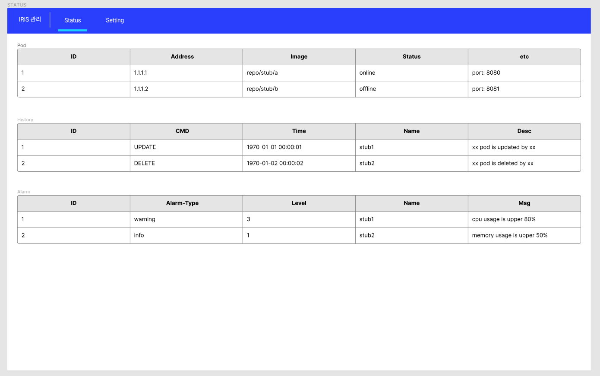
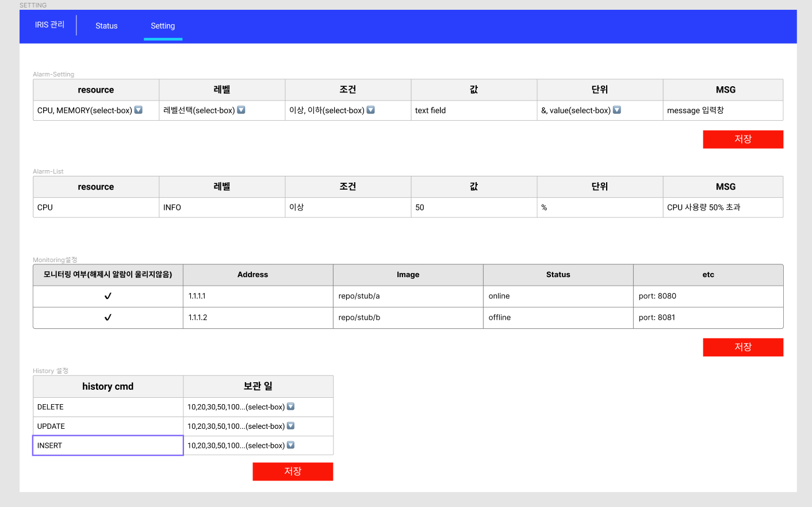

# 화면설계서
[상위메뉴로](./README.md)

\# | Category | Description | Type | Display Condition
--- | --- | --- | --- | ---
00 | STATUS | 상단앱바 STATUS 버튼 클릭시 노출   pod 리스트, history, alarm 테이블 형식으로 노출 | table | 항상
00 | SETTING | 관리자 권한이 있을시 상단앱바에 SETTING 버튼을 노출   클릭시 알람, 히스토리, 팟 노출 여부 등에 대한 세팅화면을 볼수있다 | buttom, textfield, checkbox | 관리자가 SETTING 클릭시

<!-- 00 | Monitoring | POD 선택시 RESOUCE 사용량 노출 | dashboard | pod 클릭시 -->
 
 

## STATUS 화면

 
 
 

## SETTING 화면
